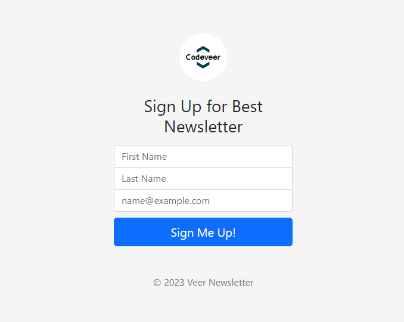

<a name="readme-top"></a>

# Newsletter Signup Page
It is a newsletter signup page.

## Preview


<!-- GETTING STARTED -->
## Getting Started

Instructions on setting up and running this project locally.

### Prerequisites

To get started with this application, you need to have Node.js and npm installed on your computer.
* npm
  ```sh
  npm install npm@latest -g
  ```

### Installation

_Below is an example of how you can instruct your audience on installing and setting up your app. This template doesn't rely on any external dependencies or services._

1. Get a free API Key at [Mailchimp](https://mailchimp.com/)
2. Clone the repo
   ```sh
   git clone https://github.com/KodeVeer/newsletter-signup.git
   ```
3. Install all NPM packages or dependencies
   ```sh
   npm install
   ```
4. Enter your API KEY and UNIQUE ID in `.env.example` and rename it to `.env`
   ```js
   MAILCHIMP_API-KEY=yourApiKeyHere
   MAILCHIMP_UNIQUE_ID=YourUniqueIdHere
   ```
5. Run Application Locally
```sh
node app.js
```

## Built With
1. Mailchimp - for the [Email Management](https://mailchimp.com/).
2. Express - for backend.
3. BodyParser


<p align="right">(<a href="#readme-top">back to top</a>)</p>

